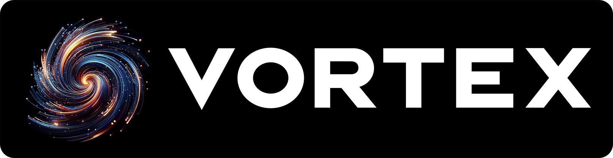
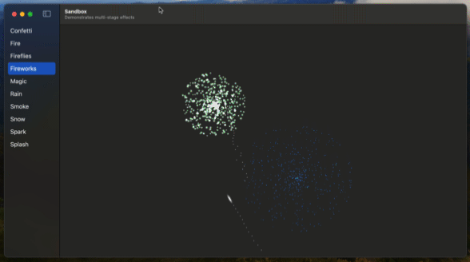

<p align="center">
    
</p>

<p align="center">
    
    
    
    
    
    <a href="https://twitter.com/twostraws">
        
    </a>
</p>

Vortex is a powerful, high-performance particle system library for SwiftUI, allowing you to create beautiful effects such as fire, rain, smoke, and snow in only a few lines of code.

Vortex comes with a range of built-in effects, such as fireworks, magic, confetti, and more, but you can also create completely custom effects that suit your needs.

This framework is compatible with iOS, macOS, tvOS, watchOS, and visionOS.


## Installing

Vortex uses Swift Package Manager, so you should use Xcode to add a package dependency for <https://github.com/twostraws/Vortex>.

Once that completes, import Vortex into your Swift code wherever needed:

```swift
import Vortex
```

In the **Assets** directory of this repository you'll find three example particle images you can use, but you're able to use a variety of SwiftUI views and shapes rather than just images.


## See it in action

This repository contains a cross-platform sample project demonstrating all the presets being used. The sample project is built using SwiftUI and requires iOS 17, macOS 14, or visionOS 1.




## Basic use

Rendering a Vortex particle system takes two steps:

1. Creating an instance of `VortexSystem`, configured for how you want your particles to behave. This must be given a list of tag names of the particles you want to render.
2. Adding a `VortexView` to your SwiftUI view hierarchy, passing in the particle system to render, and also all the views that are used for particles, tagged using the same names from step 1.

There are lots of built-in particle system designs, such as rain:

```swift
VortexView(.rain) {
    Circle()
        .fill(.white)
        .frame(width: 32)
        .tag("circle")
}
```

Fireworks:

```swift
VortexView(.fireworks) {
    Circle()
        .fill(.white)
        .blendMode(.plusLighter)
        .frame(width: 32)
        .tag("circle")
}
```

And fire:

```swift
VortexView(.fire) {
    Circle()
        .fill(.white)
        .blendMode(.plusLighter)
        .blur(radius: 3)
        .frame(width: 32)
        .tag("circle")
}
```

> [!Note]
> Each preset is designed to look for one or more tags; please check their documentation below for the correct tags to provide.

You can also create completely custom effects, like this:

```swift
struct ContentView: View {
    var body: some View {
        VortexView(createSnow()) {
            Circle()
                .fill(.white)
                .blur(radius: 5)
                .frame(width: 32)
                .tag("circle")
        }
    }

    func createSnow() -> VortexSystem {
        let system = VortexSystem(tags: ["circle"])
        system.position = [0.5, 0]
        system.speed = 0.5
        system.speedVariation = 0.25
        system.lifespan = 3
        system.shape = .box(width: 1, height: 0)
        system.angle = .degrees(180)
        system.angleRange = .degrees(20)
        system.size = 0.25
        system.sizeVariation = 0.5
        return system
    }
}
```

> [!Note] 
> `VortexView` does not copy the particle system you provide unless you specifically ask for it using `yourSystem.makeUniqueCopy()`. This allows you to create a particle system once and re-use it in multiple places without losing its state.


## Programmatic particle control

Although many particle systems emit particles constantly, it's not required – you can instead create particles that burst on demand, e.g. a confetti cannon that fires when the user presses a button.

This follows a similar approach used in SwiftUI, such as with `ScrollView` and `ScrollViewReader`: wrap your `VortexView` in a `VortexViewReader`, which passes you a `VortexProxy` object that is able to manipulate the first particle system it finds.

For example, this uses the built-in `.confetti` effect, then uses the Vortex proxy object to trigger a particle burst on demand:

```swift
VortexViewReader { proxy in
    VortexView(.confetti) {
        Rectangle()
            .fill(.white)
            .frame(width: 16, height: 16)
            .tag("square")

        Circle()
            .fill(.white)
            .frame(width: 16)
            .tag("circle")
    }

    Button("Burst", action: proxy.burst)
}
```

You can also use the proxy's `attractTo()` method to make particles move towards or away from a specific point, specified in screen coordinates. The exact behavior depends on the value you assign to the `attractionStrength` property of your particle system: positive values move towards your attraction point, whereas negative values move away.

> [!Tip]
> Call `attractTo()` with `nil` as its parameter to clear the attraction point.


## Secondary systems

One of the more advanced Vortex features is the ability create secondary particle systems – for each particle in one system to create a new particle system. This enables creation of multi-stage effects, such as fireworks: one particle launches upwards, setting off sparks as it flies, then exploding into color when it dies.

> [!Important]
> When creating particle systems with secondary systems inside, both the primary and secondary system can have their own set of tags. However, you must provide all tags from all systems when creating your `ParticleView`.


## Creating custom particle systems

The initializer for `VortexSystem` takes a wide range of configuration options to control how your particle systems behave. All but one of these has a sensible default value, allowing you to get started quickly and adjust things on the fly.

<details>
<summary> Details (Click to expand) </summary>

The `VortexSystem` initializer parameters are:

- `tags` (`[String]`, *required*) should be the names of one or more views you're passing into a `VortexView` to render this particle system. This string array might only be *some* of the views you're passing in – you might have a secondary system that uses different tags, for example.
- `secondarySystems` (`[VortexSystem]`, defaults to an empty array) should contain all the secondary particle systems that should be attached to this primary emitter.
- `spawnOccasion` (`SpawnOccasion`, defaults to `.onBirth`) determines when this secondary system should be created. Ignored if this is your primary particle system.
- `position` (`SIMD2<Double>`, defaults to `[0.5, 0.5]`) determines the center position of this particle system.
- `shape` (`Shape`, defaults to `.point`) determines the bounds of where particles are emitted. 
- `birthRate` (`Double`, defaults to 100) determines how many particles are created every second.
- `emissionLimit` (`Int?`, defaults to `nil`) determines how many total particles this system should create before it is spent.
- `emissionDuration` (`Double`, defaults to 1) determines how long this particle system should emit for before pausing. Does nothing if `idleDuration` is set to 0, because there is no pause between emissions.
- `idleDuration` (`Double`, defaults to 0) determines how much time should elapsed between emission bursts.
- `burstCount` (`Int`, defaults to 100) determines how many particles should be emitted when you call `burst()` on the `VortexProxy` for this particle system.
- `burstCountVariation` (`Int`, defaults to 0) determines how much variation to allow in bursts, +/- the base `burstCount` value.
- `lifespan` (`TimeInterval`, defaults to 1) determines how many seconds particles should live for before being destroyed.
- `lifeSpanVariation` (`TimeInterval`, defaults to 0) determines how much variation to allow in particle lifespan, +/- the base `lifespan` value.
- `speed` (`Double`, defaults to 1) determines how fast particles should be launched. A speed of 1 should allow a particle to move from one of the screen to another in 1 second.
- `speedVariation` (`Double`, defaults to 0) determines how much variation to allow in particle speed, +/- the base `speed` value.
- `angle` (`Angle`, defaults to `.zero`) determines the direction particles should be launched, where 0 is directly up.
- `angleRange` (`Angle`, defaults to `.zero`) determines how much variation to allow in particle launch direction, +/- the base `angle` value.
- `acceleration` (`SIMD2<Double>`, defaults to `[0, 0]`) determines how much to adjust particle speed over time. Positive X values make particles move to the right as if wind were blowing, and positive Y values make particles fall downwards as if affected by gravity.
- `attractionCenter` (`SIMD2<Double>?`, defaults to `nil`) makes particles move towards or away from a particular location. This should be specified in screen coordinates.
- `attractionStrength` (`Double`, defaults to 0) determines how quickly to move towards or away from the point specified in `attractionCenter`.
- `dampingFactor` (`Double`, defaults to 0) determines how quickly particles should lose momentum over time.
- `angularSpeed` (`SIMD3<Double>`, defaults to `[0, 0, 0]`) determines how quickly particles should spin in X, Y, and Z axes. Note: watchOS supports only Z rotation.
- `angularSpeedVariation` (`SIMD3<Double>`, defaults to `[0, 0, 0]` determines how much variation to allow in particle rotation speed, +/- the base `angularSpeed` value.
- `colors` (`ColorMode`, defaults to `.single(.white)`) determines how particles should be colored over time.
- `size` (`Double`, defaults to 1) determines how big particles should be compared to their source view, where 1 is 100% the original size.
- `sizeVariation` (`Double`, defaults to 0) determines how much variation to allow in initial particle size, +/- the base `size` value.
- `sizeMultiplierAtDeath` (`Double`, defaults to 1) determines how much bigger or smaller particles should be by the time they are destroyed. A value of 1 means the size won't change, whereas a value of 0.5 means particles will be half whatever their initial size was.
- `stretchFactor` (`Double`, defaults to 1) determines whether particles should be stretched based on their movement speed. A value of 1 means no stretch is applied.
- `tiltDivisor` (`Double`, defaults to 1) How much to reduce tilt effects on a particle's position.
    Larger values cause smaller changes. A value of 1 causes no reduction to tilt effects.
- `TiltAxes` (`TiltAxis`, defaults to .allCases) The axes of tilt that can affect the position of the particles.
- `tiltRate` (`SIMD2<Double>?`, defaults to `nil`) The x and y rotation rate of the device, based on `tiltDivisor`.
    A nil value here means no tilt effects will be applied.

Most of those are built-in types, but two deserve extra explanation.

First, `Shape` allows you to emit particles from a range of shapes: a single point, a straight line, a circle, and more. For example, this emits particles in a horizontal line across the available space:

    .box(width: 1, height: 0)

And this creates particles in an ellipse half the size of the available space:

    .ellipse(radius: 0.5)

Second, `ColorMode` gives you fine-grained control over how colors work with Vortex. The default value for new particle system is `.single(.white)`, which means all particles are created white. However, you can create particles in a range of static colors like this:

    .random(.red, .white, .blue)

You can also create color ramps, where particles change their colors as they age. For example, this makes particles start white, then turn red, then fade out:

    .ramp(.white, .red, .clear)

For maximum control, you can use *random ramps*, where each particle system picks a different ramp for particles to use as they age. For example, this makes some particles start red then fade out, and others start blue then fade out:

    .randomRamp([.red, .clear], [.blue, .clear])

Because Vortex uses these color modes to dynamically recolor your particles, it's a good idea to specify `.fill(.white)` when using SwiftUI's native shapes such as `Rectangle` and `Circle` to ensure the particles can be recolored correctly.

</details>


## Built-in presets

Vortex provides a selection of built-in presets to create common effects, but also to act as starting points for your own creations.


<details>
<summary> Details (Click to expand) </summary>


### Confetti

The `.confetti` preset creates a confetti effect where views fly shoot out when a burst happens. This means using a `VortexViewReader` to gain access to the Vortex proxy, like this:

```swift
VortexViewReader { proxy in
    VortexView(.confetti) {
        Rectangle()
            .fill(.white)
            .frame(width: 16, height: 16)
            .tag("square")
        
        Circle()
            .fill(.white)
            .frame(width: 16)
            .tag("circle")
    }
    
    Button("Burst", action: proxy.burst)
}
```


### Fire

The `.fire` preset creates a flame effect. This works better when your particles have a soft edge, and use a `.plusLighter` blend mode, like this:

```swift
VortexView(.fire) {
    Circle()
        .fill(.white)
        .frame(width: 32)
        .blur(radius: 3)
        .blendMode(.plusLighter)
        .tag("circle")
}
```


### Fireflies

The `.fireflies` preset creates glowing yellow dots that zoom up and fade out. This works better when your particles have a soft edge, like this:

```swift
VortexView(.fireflies) {
    Circle()
        .fill(.white)
        .frame(width: 32)
        .blur(radius: 3)
        .blendMode(.plusLighter)
        .tag("circle")
}
```


### Fireworks

The `.fireworks` preset creates a three-stage particle effect to simulate exploding fireworks. Each firework is a particle, and also launches new "spark" particles as it flies upwards. When the firework particle is destroyed, it creates an explosion effect in a range of colors.

```swift
VortexView(.fireworks) {
    Circle()
        .fill(.white)
        .frame(width: 32)
        .blur(radius: 5)
        .blendMode(.plusLighter)
        .tag("circle")
}
```


### Magic

The `.magic` preset creates a simple ring of particles that fly outwards as they fade out. This works best using the "sparkle" image contained in the Assets folder of this repository, but you can use any other image or shape you prefer.

```swift
VortexView(.magic) {
    Image(.sparkle)
        .blendMode(.plusLighter)
        .tag("sparkle")
}
```


### Rain

The `.rain` preset creates a rainfall system by stretching your view based on the rain speed:

```swift
VortexView(.rain) {
    Circle()
        .fill(.white)
        .frame(width: 32)
        .tag("circle")
}
```


### Smoke

The `.smoke` preset creates a dark gray to black smoke effect. This works best when your views are a little larger, and have soft edges:

```swift
VortexView(.smoke) {
    Circle()
        .fill(.white)
        .frame(width: 64)
        .blur(radius: 10)
        .tag("circle")
}
```


### Snow

The `.snow` preset creates a falling snow effect. This works best when your views have soft edges, like this:

```swift
VortexView(.snow) {
    Circle()
        .fill(.white)
        .frame(width: 24)
        .blur(radius: 5)
        .tag("circle")
}
```


### Spark

The `.spark` preset creates an intermittent spark effect, where sparks fly out for a short time, then pause, then fly out again, etc.

```swift
VortexView(.spark) {
    Circle()
        .fill(.white)
        .frame(width: 16)
        .tag("circle")
}
```


### Splash

The `.splash` present contains raindrop splashes, as if rain were hitting the ground. This works best in combination with the `.rain` preset, like this:

```swift
ZStack {
    VortexView(.rain) {
        Circle()
            .fill(.white)
            .frame(width: 32)
            .tag("circle")
    }

    VortexView(.splash) {
        Circle()
            .fill(.white)
            .frame(width: 16, height: 16)
            .tag("circle")
    }
}
```

### Stars

The `.stars` preset creates glowing blue and purple dots and sparkles that fade in then slowly fade out. The stars will slightly change position as the tilt of the device changes. This means using a `VortexViewReader` to gain access to the Vortex proxy, like this:

```swift
let motion = CMMotionManager()
let timer = Timer.publish(every: 1/50, on: .main, in: .common).autoconnect()

VortexViewReader { proxy in
    VortexView(.stars.makeUniqueCopy()) {
        Circle()
            .fill(.white)
            .frame(width: 18)
            .blur(radius: 3)
            .tag("circle")
            .blendMode(.plusLighter)

        Image(.sparkle)
            .tag("sparkle")
            .blendMode(.plusLighter)
    }
    .updateGyroscope(for: motion, updateInterval: 1/50)
    .onReceive(timer) { _ in
        if let data = motion.gyroData {
            proxy.tiltBy(SIMD2(data.rotationRate.x, data.rotationRate.y))
        }
    }
}
```

### Campfire

The `.campfire` creates a campfire effect. This works better when your particles have a soft edge, and use a `.plusLighter` blend mode. The campfire also sways to the direction your device is tilting, this means using a `VortexViewReader` to gain access to the Vortex proxy, like this:

```swift
let motion = CMMotionManager()
let timer = Timer.publish(every: 1/120, on: .main, in: .common).autoconnect()
    
VortexViewReader { proxy in
    VortexView(.campfire.makeUniqueCopy()) {
        Circle()
            .fill(.white)
            .frame(width: 40)
            .blur(radius: 4)
            .blendMode(.plusLighter)
            .tag("circle")
    }
    .updateGyroscope(for: motion, updateInterval: 1/120)
    .onReceive(timer) { _ in
        if let data = motion.gyroData {
            proxy.tiltBy(SIMD2(data.rotationRate.x, data.rotationRate.y))
        }
    }
}
```

</details>


## Contributing

I welcome all contributions, whether that's adding new particle system presets, fixing up existing code, adding comments, or improving this README – everyone is welcome!

- You must comment your code thoroughly, using documentation comments or regular comments as applicable.
- All code must be licensed under the MIT license so it can benefit the most people.
- Please add your code to the Vortex Sandbox app, so folks can try it out easily.


## License

MIT License.

Copyright (c) 2024 Paul Hudson.

Permission is hereby granted, free of charge, to any person obtaining a copy of this software and associated documentation files (the "Software"), to deal in the Software without restriction, including without limitation the rights to use, copy, modify, merge, publish, distribute, sublicense, and/or sell copies of the Software, and to permit persons to whom the Software is furnished to do so, subject to the following conditions:

The above copyright notice and this permission notice shall be included in all copies or substantial portions of the Software.

THE SOFTWARE IS PROVIDED "AS IS", WITHOUT WARRANTY OF ANY KIND, EXPRESS OR IMPLIED, INCLUDING BUT NOT LIMITED TO THE WARRANTIES OF MERCHANTABILITY, FITNESS FOR A PARTICULAR PURPOSE AND NONINFRINGEMENT. IN NO EVENT SHALL THE AUTHORS OR COPYRIGHT HOLDERS BE LIABLE FOR ANY CLAIM, DAMAGES OR OTHER LIABILITY, WHETHER IN AN ACTION OF CONTRACT, TORT OR OTHERWISE, ARISING FROM, OUT OF OR IN CONNECTION WITH THE SOFTWARE OR THE USE OR OTHER DEALINGS IN THE SOFTWARE.

Vortex was made by [Paul Hudson](https://twitter.com/twostraws), who writes [free Swift tutorials over at Hacking with Swift](https://www.hackingwithswift.com). It’s available under the MIT license, which permits commercial use, modification, distribution, and private use.


<p align="center">
    <a href="https://www.hackingwithswift.com/plus">
    </a>
</p>

<p align="center">&nbsp;</p>

<p align="center">
    <a href="https://www.hackingwithswift.com"></a><br />
    A Hacking with Swift Project
</p>
